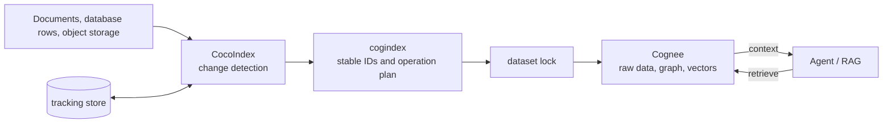

# cogindex

[](https://github.com/liuqjjin/cogindex/actions/workflows/ci.yml)
[](pyproject.toml)
[](LICENSE)

[中文说明](README.md)

cogindex maintains knowledge state for long-running Agent and RAG systems. It
synchronizes only source documents that were added, changed, or removed. If a
sync stops midway, the next run repeats replacement and cleanup work that was
not confirmed. Stable document IDs keep an edit from becoming a second,
stale document.

CocoIndex records the desired source state and sync history, while Cognee
stores raw documents, the knowledge graph, and vectors. cogindex decides when
to create, replace, recreate, or delete data. It does not rank retrieval
results, manage prompts, or generate answers.

## Problem

A long-running knowledge base is not a one-time import. Source documents are
edited and removed, processing configuration changes, and a process can exit
before raw data, graph data, vectors, and tracking records all agree. Common
failure modes include:

- an edit receives a new identity while the previous document remains stored;
- an in-place update keeps graph or vector data derived from the old content;
- an interrupted delete leaves a raw row marked complete but removes its
  derivatives;
- concurrent replacement, deletion, and dataset teardown interleave.

With Cognee 1.4, re-adding the same `data_id` does not remove old derivatives,
and the default incremental-loading and data-cache gates can skip changed
content. CocoIndex tracking and Cognee storage also cannot share a
transaction, so a retry cannot rely on the outcome of one function call.

## Sync path



During a sync, CocoIndex compares the current declarations with its previous
tracking records. cogindex computes an operation plan in the I/O-free
`reconcile()` method, then acquires a dataset lock and calls Cognee from an
asynchronous sink. Agents continue to query Cognee directly. See the
[design overview](docs/design.md) for the full call chain.

## Design

### Stable document identity

The caller supplies a source identity that does not change with the content:
for example, a repository-relative path, database primary key, or object-store
key. cogindex encodes the runtime `ContextKey`, Cognee user id and active
tenant, cogindex's logical tenant, dataset name, and source key, then derives a
UUID5 `data_id`. Content is deliberately excluded, so an edit still addresses
the original Cognee row. Including both physical ownership coordinates keeps
separate scopes on shared storage from colliding on Cognee's global `Data.id`.

Separate fingerprints cover content, external metadata, weight, label, and
processing configuration. The `data_id` selects the document; the
fingerprints select a label update, derivative replacement, or raw-row
recreation. A source rename is a delete plus a create.

### Incremental replacement and deletion

| Change | Operation |
| --- | --- |
| New document | add raw content, then cognify |
| Content, external metadata, `node_set`, or processing configuration | purge old graph and vectors, re-add under the same `data_id`, and reprocess |
| `importance_weight` | hard-delete and recreate under the same `data_id` |
| Label only, with a confirmed previous state | update the label without extraction |
| Source removed | delete the raw row and data that no remaining document references |

One dataset batch runs in a fixed order: hard deletes, derivative purges, one
batched `add`, and one `cognify` when needed. The add call explicitly disables
`incremental_loading` and `data_cache` so a completed status cannot swallow
replacement content.

### Retry after failure

Before external writes, CocoIndex keeps the new intent alongside every
possible previous record. It commits the new tracking record only after the
Cognee sink succeeds. If the process exits between those steps, the next sync
replays idempotent replacement or deletion from the old and new possibilities.

An uncertain document receives at least one purge and rebuild even when its
content fingerprint is unchanged. This repairs the state where an interrupted
hard delete removed derivatives but left the completed raw row. Convergence
assumes that the source and processing configuration eventually stop changing,
tracking history is retained, upstream recovers, and a later sink plus tracking
commit completes.

### Concurrent writers

Create, replace, delete, and whole-dataset teardown for one dataset take the
same lock. The default lock covers one process and one event loop. Multiple
processes or event loops use `PostgresAdvisoryLockProvider`, with every writer
pointing at the same PostgreSQL lock database.

The lock covers cogindex writers only; it cannot stop another application from
calling Cognee directly and does not provide generation fencing.

## Example: replace an old fact

The example needs no model credentials:

```bash
git clone https://github.com/liuqjjin/cogindex.git
cd cogindex
uv sync --all-extras
uv run python examples/agent_memory_demo.py
```

It first synchronizes `ProjectAtlas routes alerts to BlueQueue` and reads that
relationship from Cognee's graph. It then edits the same `routing.md` to say
`GreenQueue`, synchronizes again, and runs the same lookup:

```text
Agent answer: ProjectAtlas routes alerts to BlueQueue.
Agent answer: ProjectAtlas routes alerts to GreenQueue.
Graph check: GreenQueue present=True
Graph check: BlueQueue absent=True
```

Fixed LLM and embedding substitutes make extraction deterministic; the
relationship lookup reads Cognee's local graph store. The example validates
knowledge state after an update, not real-model answer quality. See
[`examples/quickstart_live.py`](examples/quickstart_live.py) for folder
synchronization and [`.env.example`](.env.example) for real-model settings.

## Validation

| Check | Current scope |
| --- | --- |
| Unit tests | 388 pytest cases |
| Failure regressions | 13 interruption scenarios, represented by 17 test functions |
| Property testing | one Hypothesis state machine, up to 60 sequences of 40 steps |
| Local Cognee integration | 14 cases over SQLite, LanceDB, embedded graph, and fixed model outputs |
| PostgreSQL lock integration | 4 cases covering exclusion and release across independent providers |
| Coverage | 403 cases requiring no external service; coverage.py branch tracking enabled, 91% total |

The core CI matrix runs Ruff, mypy, unit and property tests, and the upstream
audit gate across Linux/macOS and Python 3.11–3.13. Coverage, local Cognee,
PostgreSQL, installation from a built wheel in a clean environment, and
security auditing run as separate jobs, for 11 jobs in total. The fault model
and property tests use an explicit tracking model and in-memory runtime; the
local integration tier uses fixed model outputs. Neither is presented as a
real-LLM end-to-end test.

### Consistency comparison

The real local-storage comparison starts from the same six documents, changes
two, deletes one, and repeats each arm three times:

| Metric | Hard full rebuild | cogindex incremental sync |
| --- | ---: | ---: |
| Final documents | 5 | 5 |
| Documents submitted to `add` | 5 | 2 |
| Unchanged documents reprocessed | 3 | 0 |
| Stale version-marker entities | 0 | 0 |
| Missing expected marker entities | 0 | 0 |

On this small corpus, incremental sync was not faster: its median was 9.5655
seconds versus 7.0587 seconds for a full rebuild. The benchmark checks work
scope, document state, and specific graph markers. It does not represent
real-model throughput or scan the vector store for every possible orphan. See
[docs/benchmarks.md](docs/benchmarks.md) for the environment, raw samples, and
reproduction command.

## Installation and integration

The package is not published to PyPI:

```bash
python3 -m pip install "git+https://github.com/liuqjjin/cogindex.git"
# or
uv add "cogindex @ git+https://github.com/liuqjjin/cogindex.git"
```

Minimal setup:

```python
from pathlib import Path

import cocoindex as coco
import cogindex

COGNEE = coco.ContextKey[cogindex.CogneeRuntime]("cognee")

runtime = cogindex.LocalCogneeRuntime(
    data_root=Path("./data/cognee"),
    system_root=Path("./data/cognee-system"),
)
environment = coco.Environment(coco.Settings.from_env(db_path="./data/cocoindex-tracking"))
environment.context_provider.provide(COGNEE, runtime)


@coco.fn
async def app_main() -> None:
    target = await coco.use_mount(cogindex.declare_dataset_target, COGNEE, "docs")
    target.declare_document("guide.md", "CocoIndex tracks changes.", label="guide.md")
```

`"guide.md"` is the stable source identity. A repository-relative path,
database primary key, or object-storage key works as well. Content may change;
the key must not.

The `ContextKey` name also participates in identity and is persisted by
CocoIndex. Use a fixed logical name such as `"cognee"`, never a URL, DSN, or
credential.

`doctor()` checks the local environment. `verify_dataset()` checks raw-row
presence, identity, completion, and labels; it cannot prove that graph or
vector contents match the current text.

## Compatibility and limits

Version `0.1.0` supports Python `>=3.11,<3.14`, CocoIndex `>=1.0.18,<2`, and
Cognee `>=1.4.0,<1.5`. The API may still change; begin with datasets that can
be rebuilt.

- Cognee's REST add endpoint cannot accept a caller-supplied `data_id`, so
  only the local Python SDK runtime is supported.
- `LocalCogneeRuntime` rejects an active `cognee.serve()` remote client; call
  `await cognee.disconnect()` first.
- `data_root` and `system_root` are required, and all live local runtimes in
  one process must use the same pair.
- An embedding model absent from Cognee's dimension registry requires its
  actual vector width in `EMBEDDING_DIMENSIONS`. A width change detected
  around a pipeline run fails instead of confirming the sync.
- Cognee's model, prompt, ontology, and embedding settings are process-global.
  Do not mutate them between target construction and sink completion; start a
  new flow run after a deliberate configuration change.
- The local runtime accepts only `tenant="default"`; the Cognee user id and
  that user's active tenant jointly define the physical access scope. Do not
  switch the active tenant while a sync is running.
- Keep one `ContextKey` bound to the same user id and active tenant. A runtime
  can detect rebinding only within its own process; after a cross-run rebind,
  sync or unmount may act on the new scope's same-name dataset. Clean up or
  reconcile the old scope under its old binding, then use a new `ContextKey`
  for the new scope.
- Unmounting a system-managed target hard-deletes its Cognee dataset.
  `managed_by="user"` suppresses only that whole-dataset teardown.
- Cognee does not propagate individual raw-row deletion errors during
  whole-dataset teardown, so an undetectable orphan row is possible.
- If a custom chunker or graph model changes implementation without changing its class name or
  schema, bump an implementation revision in `ProcessingConfig.extras` to trigger reprocessing.
- Losing the CocoIndex tracking store removes the ownership history needed to
  identify source documents that were deleted. An exclusively owned dataset
  must be stopped, hard-emptied, and fully synchronized; shared datasets need
  manual reconciliation or a new name.
- `verify_dataset()` cannot see whether graph and vector derivatives still
  match the current source content.

## Development and documentation

```bash
make ci
make test-integration
make test-postgres
make coverage
make smoke
make benchmark-smoke
```

- [Public API](src/cogindex/__init__.py)
- [Design overview](docs/design.md)
- [Architecture decisions](docs/adr/)
- [Pinned upstream behavior](docs/upstream-audit/)
- [Examples](examples/)
- [Contributing](CONTRIBUTING.md)

cogindex depends on [CocoIndex](https://github.com/cocoindex-io/cocoindex) and
[Cognee](https://github.com/topoteretes/cognee), but is not affiliated with
either project. The license is Apache-2.0; see
[ATTRIBUTION.md](ATTRIBUTION.md) for third-party notices.
