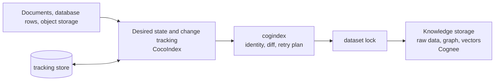

# cogindex

[](https://github.com/liuqjjin/cogindex/actions/workflows/ci.yml)
[](pyproject.toml)
[](LICENSE)

[中文说明](README.md)

cogindex keeps changing document sources consistent with their stored
knowledge-base state. It assigns stable identities to source documents,
updates only the affected state when content or processing configuration
changes, and replays operations that were not confirmed after an interrupted
sync.

cogindex owns write-side identity, replacement, deletion, retry, and dataset
locking. Retrieval, ranking, and answer generation are outside its scope.

## Why

A long-running knowledge store is not a one-time import. Documents are edited
and removed, processing configuration changes, and a process may exit before
raw data, graph data, vectors, and tracking records agree. Three risks matter:

- a content-derived identity turns an edit into a second document;
- an in-place rewrite can leave graph and vector data derived from old text;
- the tracking store and knowledge store cannot share a transaction, so one
  function return value is not enough to recover an interrupted write.

cogindex separates identity from content, expresses replacement and deletion
as replay-safe steps, and confirms tracking state only after the external write
succeeds.

## Installation

The package is not published to PyPI:

```bash
python3 -m pip install "git+https://github.com/liuqjjin/cogindex.git"
# or
uv add "cogindex @ git+https://github.com/liuqjjin/cogindex.git"
```

Supported versions are Python `>=3.11,<3.14`, CocoIndex `>=1.0.18,<2`, and
Cognee `>=1.4.0,<1.5`.

## Five-minute review path

After installing the development dependencies, run these commands from the
repository root:

```bash
uv run python examples/agent_memory_demo.py
uv run pytest tests/unit/test_fault_matrix.py -q
```

The first command uses a real local Cognee stack with fixed-output model
substitutes. It edits one document from `BlueQueue` to `GreenQueue`, syncs
again, queries the graph directly, and checks that the old entity is gone. The
second command injects failures around locking, hard deletion, derivative
cleanup, writing, processing, and tracking-state commit across 17 regression
cases.

The fault matrix uses an in-memory runtime and a model of CocoIndex tracking
semantics. It demonstrates convergence after a successful retry within that
model; it is not an end-to-end operating-system crash test. See the
[example guide](examples/) for the full example and test tiers.

## Minimal integration

```python
from pathlib import Path

import cocoindex as coco
import cogindex

COGNEE = coco.ContextKey[cogindex.CogneeRuntime]("cognee")

runtime = cogindex.LocalCogneeRuntime(
    data_root=Path("./data/cognee"),
    system_root=Path("./data/cognee-system"),
)
environment = coco.Environment(coco.Settings.from_env(db_path="./data/tracking"))
environment.context_provider.provide(COGNEE, runtime)


@coco.fn
async def app_main() -> None:
    target = await coco.use_mount(cogindex.declare_dataset_target, COGNEE, "docs")
    target.declare_document("guide.md", "This content may change on the next run.")
```

`"guide.md"` is the stable source identity. A repository-relative path,
database primary key, or object-store key works as well. Content may change;
the key must not. The `ContextKey` also needs a fixed logical name and must not
contain a URL, DSN, or credential.

See [`examples/quickstart_live.py`](examples/quickstart_live.py) for a complete
folder sync. `doctor()` checks local configuration. `verify_dataset()` compares
document presence, identity, processing status, and labels.

## How it works



`reconcile()` compares declarations with previous records and performs no I/O.
Connections, locking, cleanup, and writes happen in asynchronous sinks. See
the [design overview](docs/design.md) for the full call chain.

### Identity and change classification

A document `data_id` is a UUID5 over the identity schema, runtime key, resolved
Cognee user/tenant scope, dataset, and source key. Content is excluded. While
those coordinates remain stable, an edit addresses the same stored identity.

Separate fingerprints cover content, external metadata, weight, label, and
processing configuration. Identity selects the record; fingerprints select a
label update, derivative replacement, raw-row recreation, or deletion. Model,
prompt, chunking, ontology, and embedding changes invalidate derivatives.
Credentials, endpoints, timeouts, and logging settings never enter tracking
records.

### Synchronization rules

| Change | Operation |
| --- | --- |
| New document | write raw content, then process it |
| Content, external metadata, `node_set`, or processing configuration | purge old graph and vectors, re-add under the same ID, and reprocess |
| `importance_weight` | hard-delete and recreate under the same ID |
| Label only, with a confirmed previous state | update the label without extraction |
| Source removed | delete raw content and derivatives no longer referenced elsewhere |

One dataset batch runs hard deletes, derivative purges, one batched write, and
one processing call when required. Unchanged documents do not re-enter the
write path.

### Recovery

The tracking store and Cognee cannot share a transaction. Before a sink runs,
CocoIndex retains the intended record and every possible old record. The new
record is confirmed only after the sink succeeds. If the process exits between
those steps, the next sync treats the state as uncertain and safely replays
replacement or deletion.

An existing document that may be missing receives at least one purge and
rebuild even if its content fingerprint is unchanged. This repairs an
interrupted delete that removed derivatives but left a raw row marked complete.
Convergence assumes stable desired state, retained tracking history, upstream
recovery, and at least one later sink-plus-commit that completes.

### Concurrency

Create, replace, delete, and whole-dataset teardown for one dataset take the
same lock. `InProcessLockProvider` covers one process and event loop.
Multi-process or multi-loop writers use `PostgresAdvisoryLockProvider`, with
every writer pointing at the same PostgreSQL lock database.

The lock covers cogindex writers only. It cannot stop another application from
writing Cognee directly and does not provide generation fencing.

## Runnable examples

From the repository root:

```bash
uv sync --all-extras
mkdir -p my-docs
printf 'AlphaCorp uses SharedQueue.\\n' > my-docs/guide.md
uv run python examples/quickstart_live.py ./my-docs --deterministic
uv run python examples/shared_entity_demo.py
```

`quickstart_live.py` covers folder additions, edits, and removals.
`shared_entity_demo.py` shows that a graph entity survives until its final
source is removed. [`agent_memory_demo.py`](examples/agent_memory_demo.py)
shows a downstream graph query after one document changes from `BlueQueue` to
`GreenQueue`. Fixed model substitutes make extraction reproducible; they do
not represent real-model quality.

## Evaluation

`make ci` runs Ruff, strict mypy, the upstream-review coverage gate, unit
tests, and the Hypothesis state machine. The core matrix covers Linux, macOS,
and Python 3.11–3.13. Local Cognee integration, PostgreSQL locking, clean-wheel
installation, and dependency auditing run separately. Current total coverage
is 90% with branch tracking enabled.

The consistency comparison starts with six documents, changes two, and removes
one:

| Metric | Hard full rebuild | cogindex incremental sync |
| --- | ---: | ---: |
| Final documents | 5 | 5 |
| Documents submitted to the write stage | 5 | 2 |
| Unchanged documents reprocessed | 3 | 0 |
| Checked stale version-marker entities | 0 | 0 |
| Checked missing expected marker entities | 0 | 0 |

This scenario checks work scope and specific state markers. It uses no real
model and is not a throughput claim or proof that every possible orphan vector
is absent. See [the benchmark notes](docs/benchmarks.md) for the environment,
raw samples, and reproduction command.

## Compatibility and limits

Version `0.1.0` has an evolving API. Start with datasets that can be rebuilt.

- Cognee's REST `add` cannot accept a caller-supplied `data_id`; only the local
  Python SDK runtime is supported.
- `LocalCogneeRuntime` requires explicit `data_root` and `system_root`, and all
  live instances in one process must use the same pair. Unregistered embedding
  models also require an explicit `EMBEDDING_DIMENSIONS`.
- Cognee model, prompt, ontology, embedding, and active-tenant settings are
  process-global and must not change during a sync.
- Replacing a llama.cpp weight file at the same path does not change the
  automatic processing fingerprint; bump a stable model revision in
  `ProcessingConfig.extras` at the same time.
- Keep a `ContextKey` bound to one Cognee user/tenant scope. Process a previous
  scope under its old binding before switching to a new key.
- Unmounting a system-managed target deletes the whole dataset.
  `managed_by="user"` suppresses only that teardown. Cognee does not currently
  propagate individual raw-row deletion failures from whole-dataset cleanup.
- Losing the tracking store removes the ownership history needed to identify
  source documents that were deleted. An exclusively owned dataset must be
  stopped, hard-emptied, and fully synchronized; shared datasets need manual
  reconciliation or a new name.
- `verify_dataset()` reads under the dataset lock, but does not compare raw
  content, graph nodes, or vectors and cannot by itself prove derivative
  freshness.

See the [design overview](docs/design.md) and
[architecture decisions](docs/adr/) for the complete operating boundaries.

## Development

```bash
make ci
make test-integration  # local Cognee with fixed model outputs
make test-postgres
make coverage
make smoke
make build
```

- [Public API](src/cogindex/__init__.py)
- [Design overview](docs/design.md)
- [Architecture decisions](docs/adr/)
- [Pinned upstream behavior](docs/upstream-audit/)
- [Examples](examples/)
- [Contributing](CONTRIBUTING.md)

cogindex depends on [CocoIndex](https://github.com/cocoindex-io/cocoindex) and
[Cognee](https://github.com/topoteretes/cognee), but is not affiliated with
either project. The license is Apache-2.0; see
[ATTRIBUTION.md](ATTRIBUTION.md) for third-party notices.
