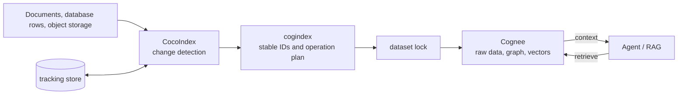

# cogindex

[](https://github.com/liuqjjin/cogindex/actions/workflows/ci.yml)
[](pyproject.toml)
[](LICENSE)

[中文说明](README.md)

Importing a document into Cognee once is straightforward: call `add()` and
`cognify()`. The difficult part is the next sync. Re-adding edited content
does not remove the old graph and vectors; deleting a source requires its
original `data_id`; and an interrupted delete can leave a raw row marked
complete with no corresponding graph data.

cogindex implements a CocoIndex target for this job. CocoIndex detects source
changes. cogindex derives a fixed `data_id` from the stable source identity,
then orders the create, replace, and delete operations. Cognee still owns
extraction and retrieval.

## Data flow



Agents query Cognee directly. cogindex does not rank retrieval results or
generate answers; it only keeps the queried data aligned with the source
documents. See [the design overview](docs/design.md) for the full flow,
failure model, and lock boundary.

## Run the example

The Agent-memory example needs no model credentials:

```bash
git clone https://github.com/liuqjjin/cogindex.git
cd cogindex
uv sync --all-extras
uv run python examples/agent_memory_demo.py
```

The script first synchronizes `ProjectAtlas routes alerts to BlueQueue` and
queries the route from Cognee's graph. It then edits the same `routing.md`
document to say `GreenQueue`, synchronizes again, and queries the graph a
second time:

```text
Agent answer: ProjectAtlas routes alerts to BlueQueue.
Agent answer: ProjectAtlas routes alerts to GreenQueue.
Graph check: GreenQueue present=True
Graph check: BlueQueue absent=True
```

`MemoryAgent` has one graph-query method. The example replaces LLM and
embedding calls with fixed outputs while keeping Cognee's local database,
graph store, and vector store on their normal path.

See [`examples/quickstart_live.py`](examples/quickstart_live.py) for folder
synchronization and [`.env.example`](.env.example) for real-model settings.

## Use it in a CocoIndex project

The package is not published to PyPI:

```bash
python3 -m pip install "git+https://github.com/liuqjjin/cogindex.git"
# or
uv add "cogindex @ git+https://github.com/liuqjjin/cogindex.git"
```

Minimal setup:

```python
from pathlib import Path

import cocoindex as coco
import cogindex

COGNEE = coco.ContextKey[cogindex.CogneeRuntime]("cognee")

runtime = cogindex.LocalCogneeRuntime(
    data_root=Path("./data/cognee"),
    system_root=Path("./data/cognee-system"),
)
environment = coco.Environment(coco.Settings.from_env(db_path="./data/cocoindex-tracking"))
environment.context_provider.provide(COGNEE, runtime)


@coco.fn
async def app_main() -> None:
    target = await coco.use_mount(cogindex.declare_dataset_target, COGNEE, "docs")
    target.declare_document("guide.md", "CocoIndex tracks changes.", label="guide.md")
```

`"guide.md"` is the stable source identity. A repository-relative path,
database primary key, or object-storage key works as well. Content may change;
the key must not.

The `ContextKey` name also participates in identity and is persisted by
CocoIndex. Use a fixed logical name such as `"cognee"`, never a URL, DSN, or
credential.

## Updates, failures, and concurrency

| Change | cogindex operation |
| --- | --- |
| New document | add raw content, then cognify |
| Content, external metadata, `node_set`, or processing configuration | purge the old graph and vectors, re-add under the same `data_id`, and reprocess |
| `importance_weight` | hard-delete the row and recreate it under the same `data_id` |
| Label only, with a confirmed previous state | update the label without extraction |
| Source removed | delete the raw row and data that no remaining document references |

CocoIndex tracking and Cognee storage cannot share one transaction. A sink is
therefore safe to execute at least once, and CocoIndex commits the new tracking
record only after the sink succeeds. If a process stops in between, the next
sync conservatively retries from the possible old and new records.

All writes, deletes, and whole-dataset teardown for one dataset take the same
lock. The default lock covers one process and one event loop. Deployments with
multiple processes or event loops can use `PostgresAdvisoryLockProvider`;
every writer must use the same PostgreSQL lock database.

`doctor()` checks the local environment. `verify_dataset()` checks raw-row
presence, identity, completion, and labels; it cannot prove that graph or
vector contents match the current text.

## Development

```bash
make ci
make test-integration
make test-postgres
make coverage
make smoke
make benchmark-smoke
```

The core matrix runs on Linux and macOS with Python 3.11–3.13. Separate jobs
exercise local Cognee, PostgreSQL locks, dependency auditing, and installation
from a clean wheel.

The benchmark compares a hard full rebuild with syncing only changed
documents. On the current small corpus, incremental sync processes fewer
documents but does not finish faster. See [docs/benchmarks.md](docs/benchmarks.md)
for the method, raw samples, and reproduction command.

## Compatibility and limits

Version `0.1.0` supports Python `>=3.11,<3.14`, CocoIndex `>=1.0.18,<2`, and
Cognee `>=1.4.0,<1.5`. The API may still change; begin with datasets that can
be rebuilt.

- Cognee's REST add endpoint cannot accept a caller-supplied `data_id`, so
  only the local Python SDK runtime is supported.
- `LocalCogneeRuntime` rejects an active `cognee.serve()` remote client; call
  `await cognee.disconnect()` first.
- `data_root` and `system_root` are required, and all live local runtimes in
  one process must use the same pair.
- The local runtime accepts only `tenant="default"`; the Cognee user defines
  the physical access scope.
- Unmounting a system-managed target hard-deletes its Cognee dataset.
  `managed_by="user"` suppresses only that whole-dataset teardown.
- Cognee does not propagate individual raw-row deletion errors during
  whole-dataset teardown, so an undetectable orphan row is possible.
- Losing the CocoIndex tracking store removes the ownership history needed to
  identify source documents that were deleted. An exclusively owned dataset
  must be stopped, hard-emptied, and fully synchronized; shared datasets need
  manual reconciliation or a new name.

## Documentation

- [Public API](src/cogindex/__init__.py)
- [Design overview](docs/design.md)
- [Architecture decisions](docs/adr/)
- [Pinned upstream behavior](docs/upstream-audit/)
- [Examples](examples/)
- [Contributing](CONTRIBUTING.md)

cogindex depends on [CocoIndex](https://github.com/cocoindex-io/cocoindex) and
[Cognee](https://github.com/topoteretes/cognee), but is not affiliated with
either project. The license is Apache-2.0; see
[ATTRIBUTION.md](ATTRIBUTION.md) for third-party notices.
