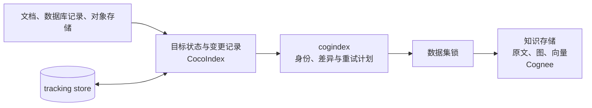

# cogindex

[](https://github.com/liuqjjin/cogindex/actions/workflows/ci.yml)
[](pyproject.toml)
[](LICENSE)

[英文版](README.en.md)

cogindex 维护持续变化的知识源与知识库索引状态之间的一致性。它为每份源文档生成稳定
身份，根据正文和处理配置的变化只更新必要部分，并在一次同步没有完成时重新执行尚未
确认的操作。

当前实现使用 CocoIndex 保存目标状态和同步记录，使用 Cognee 保存原文、知识图谱和
向量。cogindex 负责写入、替换、删除、重试和数据集锁；检索、排序与回答生成不在项目
范围内。

## 为什么需要它

知识库不是一次性导入。文档会修改或删除，模型、提示词和分块配置也会变化，而一次写入
可能在原文、图、向量与同步记录全部一致之前中断。这里有三个容易被忽略的问题：

- 如果身份来自正文，编辑会创建第二份文档，旧文档仍留在库中；
- 如果沿用原身份直接重写，旧正文产生的图和向量可能继续存在；
- 状态库与知识存储不能共用事务，进程退出后不能只凭一次函数调用的返回值判断结果。

cogindex 将文档身份与正文分开，把替换和删除拆成可重复执行的步骤，并在外部写入成功后
才确认新的同步记录。

## 安装

项目尚未发布到 PyPI，可以直接从 Git 安装：

```bash
python3 -m pip install "git+https://github.com/liuqjjin/cogindex.git"
# 或
uv add "cogindex @ git+https://github.com/liuqjjin/cogindex.git"
```

支持 Python `>=3.11,<3.14`、CocoIndex `>=1.0.18,<2` 和
Cognee `>=1.4.0,<1.5`。

## 最小接入

```python
from pathlib import Path

import cocoindex as coco
import cogindex

COGNEE = coco.ContextKey[cogindex.CogneeRuntime]("cognee")

runtime = cogindex.LocalCogneeRuntime(
    data_root=Path("./data/cognee"),
    system_root=Path("./data/cognee-system"),
)
environment = coco.Environment(coco.Settings.from_env(db_path="./data/tracking"))
environment.context_provider.provide(COGNEE, runtime)


@coco.fn
async def app_main() -> None:
    target = await coco.use_mount(cogindex.declare_dataset_target, COGNEE, "docs")
    target.declare_document("guide.md", "这段正文可以在下次运行时修改。")
```

`"guide.md"` 是源系统中的稳定标识，可以换成仓库相对路径、数据库主键或对象存储键。
正文可以变化，这个标识不要跟着变化。`ContextKey` 也应使用固定的逻辑名称，不能包含
URL、DSN 或密钥。

完整的目录同步示例见
[`examples/quickstart_live.py`](examples/quickstart_live.py)。
`doctor()` 用于检查本地环境；`verify_dataset()` 用于核对文档是否存在、身份、处理状态
和标签。

## 工作方式



`reconcile()` 只比较当前声明和上次记录，不执行 I/O。实际连接、加锁、清理和写入都在
异步 sink 中完成。完整调用链见[设计说明](docs/design.md)。

### 身份与变化判定

文档 `data_id` 是 UUID5，输入包括固定身份版本、runtime key、实际 Cognee user/tenant
范围、数据集和源端业务键，正文不参与计算。在这些坐标保持不变时，同一逻辑文档始终
写入同一个身份。

正文、外部元数据、权重、标签和处理配置分别计算指纹。身份决定操作哪条记录，指纹决定
本次是更新标签、替换派生数据、重建原文还是删除。模型、提示词、分块、ontology 和
embedding 配置变化也会使派生结果失效；密钥、连接地址、超时和日志参数不会写入同步
记录。

### 同步规则

| 变化 | 操作 |
| --- | --- |
| 新增文档 | 写入原文，再执行处理 |
| 正文、外部元数据、`node_set` 或处理配置变化 | 清理旧图和向量，沿用原 ID 重新写入和处理 |
| `importance_weight` 变化 | 硬删除原文，沿用原 ID 重新创建 |
| 仅标签变化，且上次状态已确认 | 更新标签，不重复抽取 |
| 文档不再声明 | 删除原文及不再被其他文档引用的派生数据 |

一个数据集批次按固定顺序执行：硬删除、清理旧派生数据、批量写入，最后按需执行一次
处理。这样既避免旧派生数据残留，也避免为未修改的文档重复处理。

### 中断恢复

状态库和 Cognee 无法放进一个事务。CocoIndex 在 sink 执行前保留本次意图和所有可能的
旧记录，只有 sink 成功后才确认新记录。如果进程在两步之间退出，下次同步会把状态视为
不确定，并安全重放替换或删除。

当一个已有文档可能缺失时，即使正文指纹没有变化也至少执行一次派生数据清理和重建。
这是为了修复删除中断后“原文仍显示完成，但图和向量已经不存在”的状态。收敛要求源数据
和配置最终停止变化、tracking store 没有丢失，并且后续至少有一次 sink 与记录提交都
成功。

### 并发写入

同一数据集的新增、替换、删除和整库清理使用同一把锁。默认
`InProcessLockProvider` 适用于单进程、单事件循环；多个进程或事件循环写同一数据集时，
使用 `PostgresAdvisoryLockProvider`，并让所有写入方连接同一个 PostgreSQL 锁数据库。

锁只约束通过 cogindex 发起的操作，不能阻止其他程序绕过它直接写 Cognee，也不提供跨
版本的写入围栏。

## 可运行示例

从仓库根目录运行：

```bash
uv sync --all-extras
mkdir -p my-docs
printf 'AlphaCorp 使用 SharedQueue。\\n' > my-docs/guide.md
uv run python examples/quickstart_live.py ./my-docs --deterministic
uv run python examples/shared_entity_demo.py
```

`quickstart_live.py` 演示目录中文档的新增、修改和删除；
`shared_entity_demo.py` 演示一条共享图实体在最后一个来源删除前仍被保留。另有
[`agent_memory_demo.py`](examples/agent_memory_demo.py) 展示同一文档从 `BlueQueue`
改为 `GreenQueue` 后，下游图查询只读取到更新后的关系。固定输出的模型替身只用于让
抽取结果可重复，不代表真实模型质量。

## 验证

`make ci` 运行 Ruff、严格 mypy、上游审阅覆盖检查、单元测试和 Hypothesis 状态机。
核心 CI 覆盖 Linux、macOS 与 Python 3.11–3.13；真实本地 Cognee、PostgreSQL 锁、
wheel 安装和依赖审计分别运行。当前 coverage.py 开启分支统计后的总覆盖率为 90%。

一致性对比从 6 篇文档开始，修改 2 篇并删除 1 篇：

| 指标 | 清空后全量重建 | cogindex 增量同步 |
| --- | ---: | ---: |
| 最终文档数 | 5 | 5 |
| 送入写入阶段的文档数 | 5 | 2 |
| 未修改但被重新处理的文档数 | 3 | 0 |
| 检查的旧版本标记实体残留 | 0 | 0 |
| 检查的应有标记实体缺失 | 0 | 0 |

这个场景验证处理范围和特定状态，不使用真实模型，也不用于宣称吞吐量或证明任意孤立
向量为零。环境、原始样本和复现命令见[基准测试](docs/benchmarks.md)。

## 兼容性与限制

当前版本为 `0.1.0`，API 仍可能调整，建议先用于可以重新构建的数据集。

- Cognee REST `add` 不能接收调用方指定的 `data_id`，目前只支持本地 Python SDK；
- `LocalCogneeRuntime` 必须显式设置 `data_root` 和 `system_root`，同一进程中的实例要
  使用同一组目录；未登记的 embedding 模型还需要显式设置 `EMBEDDING_DIMENSIONS`；
- Cognee 的模型、提示词、ontology、embedding 与 active tenant 是进程级状态，一次同步
  期间不能修改；
- 同一路径替换 llama.cpp 权重文件不会自动改变处理指纹，需要同时在
  `ProcessingConfig.extras` 中更新一个稳定的模型版本；
- 同一个 `ContextKey` 必须始终绑定同一 Cognee user/tenant 范围。切换范围时要先处理旧
  范围，再使用新的 key；
- 卸载由系统管理的 target 会删除整个数据集；`managed_by="user"` 只跳过这次整库清理。
  Cognee 目前不会向上抛出整库清理中个别原文的删除失败；
- tracking store 丢失后，普通重跑无法识别已经从源端删除的旧文档。独占数据集需要停止
  写入、清空后全量同步；共享数据集需要人工核对或使用新的数据集名称；
- `verify_dataset()` 在数据集锁内读取，但不比较正文、图节点和向量内容，不能单独证明
  所有派生数据仍与当前正文一致。

更完整的运行边界见[设计说明](docs/design.md)和[架构决策记录](docs/adr/)。

## 开发

```bash
make ci
make test-integration  # 本地 Cognee，模型调用使用固定输出
make test-postgres
make coverage
make smoke
make build
```

- [公开 API](src/cogindex/__init__.py)
- [设计说明](docs/design.md)
- [架构决策记录](docs/adr/)
- [上游行为记录](docs/upstream-audit/)
- [示例](examples/)
- [贡献指南](CONTRIBUTING.md)

cogindex 依赖 [CocoIndex](https://github.com/cocoindex-io/cocoindex) 和
[Cognee](https://github.com/topoteretes/cognee)，与两个项目均无隶属关系。

项目使用 Apache-2.0 许可证，第三方依赖和许可证说明见
[ATTRIBUTION.md](ATTRIBUTION.md)。
