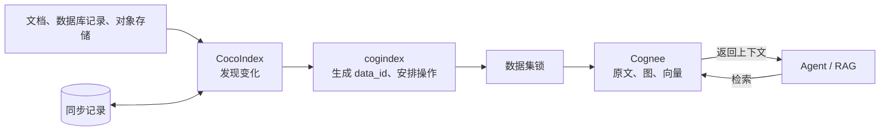

# cogindex

[](https://github.com/liuqjjin/cogindex/actions/workflows/ci.yml)
[](pyproject.toml)
[](LICENSE)

[英文版](README.en.md)

cogindex 用来让长期运行的 Agent / RAG 知识库跟随源文档更新。文档新增、修改或删除时，
它只同步变化的部分；同步中途退出后，下一次运行会重做尚未确认的替换和清理。同一份文档
始终使用稳定 ID，正文改写时会先清理旧图和向量，不会额外留下一份旧文档。

实现上，CocoIndex 记录源端当前应该存在的文档和同步状态，Cognee 保存原文、知识图谱和
向量。cogindex 根据两边的状态决定新增、替换、重建或删除，不负责检索排序、提示词和
回答生成。

## 要解决的问题

长期运行的知识库不是一次性导入。源文档会修改或删除，模型、提示词和分块配置会变化，
写入也可能在原文、图、向量和同步记录全部完成前退出。处理不当时会出现几类问题：

- 同一文档改了正文，却生成另一条身份，旧文档继续留在知识库；
- 沿用原身份重新写入，但旧的图节点和向量没有清理，新旧事实同时参与检索；
- 删除执行到一半，原文仍标记为处理完成，图和向量却已经不存在；
- 两个写入进程交错执行替换、删除或整库清理，最终状态取决于执行顺序。

Cognee 1.4 对同一 `data_id` 再次执行 `add` 不会删除旧的派生数据，默认的增量加载和
数据缓存还可能跳过改过的正文。另一方面，CocoIndex 的同步记录与 Cognee 的存储无法
共用一个事务，所以重试不能只看某次调用是否返回成功。

## 同步路径



一次同步中，CocoIndex 比较当前声明与上次记录；cogindex 在不做 I/O 的
`reconcile()` 中生成操作计划，再在异步 sink 中获取数据集锁并调用 Cognee。Agent 或
RAG 应用仍然直接查询 Cognee。完整调用链见[设计说明](docs/design.md)。

## 设计

### 稳定文档身份

调用方为每份文档提供不会随正文变化的标识，例如仓库相对路径、数据库主键或对象存储
键。cogindex 将 runtime 的 `ContextKey`、Cognee user id 与 active tenant、cogindex 的
逻辑 tenant、数据集名称和源端业务键一起编码，再计算 UUID5，得到固定的 `data_id`。
正文不参与身份计算，因此一次编辑仍然指向原来的 Cognee 记录；user id 与 active tenant
都参与计算，避免共用存储时不同访问范围撞到 Cognee 的全局 `Data.id`。

正文、外部元数据、权重、标签和处理配置分别计算指纹。`data_id` 决定操作哪一份文档，
指纹决定这次需要更新标签、清理派生数据还是重建原文。文档改名按删除旧标识、创建新标识
处理；项目不做重命名检测。

### 增量替换和删除

| 变化 | 执行方式 |
| --- | --- |
| 新增文档 | 写入原文，再执行 `cognify` |
| 正文、外部元数据、`node_set` 或处理配置变化 | 清理旧图和向量，沿用原 `data_id` 重新写入和处理 |
| `importance_weight` 变化 | 硬删除原文，沿用原 `data_id` 重新创建 |
| 仅标签变化，且上次状态已确认 | 更新标签，不重复抽取 |
| 文档不再声明 | 删除原文，以及不再被其他文档引用的图和向量数据 |

一个数据集批次按固定顺序执行：硬删除、清理旧派生数据、批量 `add`，最后按需执行一次
`cognify`。`add` 会显式关闭 `incremental_loading` 和 `data_cache`，防止完成状态跳过
替换后的正文。

### 失败后的重试

CocoIndex 在外部写入前保留本次意图和所有可能的旧记录。Cognee 操作成功后，新的同步
记录才会提交；如果进程在两步之间退出，下一次同步会根据新旧记录重新执行可重复的替换
或删除。

状态不确定时，即使正文指纹没有变化也会至少执行一次清理和重建。这样可以修复“原文
仍显示完成、派生数据已经在中断的删除中消失”的状态。收敛依赖几个前提：源文档和处理
配置最终停止变化、同步记录没有丢失、上游恢复可用，并且后续至少有一次 sink 与记录提交
都完成。

### 并发写入

同一数据集的新增、替换、删除和整库清理使用同一把锁。默认的进程内锁适合单进程、
单事件循环；多个进程或事件循环写同一数据集时，使用
`PostgresAdvisoryLockProvider`，并让所有写入方连接同一个 PostgreSQL 锁数据库。

锁只约束通过 cogindex 发起的操作，不能阻止其他程序直接写 Cognee，也不提供跨版本的
写入围栏。

## 示例：旧事实被替换

下面的示例不需要模型密钥：

```bash
git clone https://github.com/liuqjjin/cogindex.git
cd cogindex
uv sync --all-extras
uv run python examples/agent_memory_demo.py
```

脚本先同步 `ProjectAtlas routes alerts to BlueQueue`，并从 Cognee 图中读取当前路由；
随后把同一份 `routing.md` 改成 `GreenQueue`，再次同步并执行相同查询。脚本同时直接
检查新实体已经出现、旧实体已经删除：

```text
Agent answer: ProjectAtlas routes alerts to BlueQueue.
Agent answer: ProjectAtlas routes alerts to GreenQueue.
Graph check: GreenQueue present=True
Graph check: BlueQueue absent=True
```

固定输出的 LLM 与嵌入测试实现只用于让抽取结果可重复；关系查询读取的是 Cognee 的本地图
存储。这个示例验证知识更新后的状态，不评估真实模型的回答质量。目录同步见
[`examples/quickstart_live.py`](examples/quickstart_live.py)，真实模型配置见
[`.env.example`](.env.example)。

## 验证

### 自动化测试

| 检查 | 当前范围 |
| --- | --- |
| 单元测试 | 388 个 pytest 用例 |
| 故障回归 | 13 类中断场景，对应 17 个测试函数 |
| 属性测试 | 1 个 Hypothesis 状态机，最多 60 组序列、每组 40 步 |
| 本地 Cognee 集成 | 14 个用例，使用 SQLite、LanceDB、内嵌图数据库和固定输出模型 |
| PostgreSQL 锁集成 | 4 个用例，覆盖独立进程锁提供者之间的互斥和释放 |
| 覆盖率 | 不依赖外部服务的集合 403 项通过；coverage.py 开启分支统计，总覆盖率 91% |

核心 CI 在 Linux、macOS 和 Python 3.11–3.13 的 6 个组合上运行 Ruff、mypy、单元测试、
属性测试和上游审阅覆盖检查；另有 coverage、本地 Cognee、PostgreSQL、wheel 安装和
安全审计任务，共 11 个任务。故障矩阵和属性测试使用显式 tracking model 与内存 runtime，
本地 Cognee 集成使用固定输出模型；它们都不冒充真实 LLM 端到端测试。

### 一致性对比

真实本地存储对比从相同的 6 篇文档开始，修改 2 篇、删除 1 篇，重复 3 次：

| 指标 | 清空后全量重建 | cogindex 增量同步 |
| --- | ---: | ---: |
| 最终文档数 | 5 | 5 |
| 送入 `add` 的文档数 | 5 | 2 |
| 未修改但被重新处理 | 3 | 0 |
| 旧版本标记实体残留 | 0 | 0 |
| 应有标记实体缺失 | 0 | 0 |

这个小语料中，增量同步中位耗时为 9.5857 秒，全量重建为 7.0370 秒，增量方案没有更快。
这组数据用于核对处理范围、文档状态和特定图实体，不代表真实模型吞吐量，也没有扫描
向量库来证明任意孤立向量为零。测试环境、原始样本和复现命令见
[基准测试](docs/benchmarks.md)。

## 安装与接入

项目尚未发布到 PyPI，可以直接从 Git 安装：

```bash
python3 -m pip install "git+https://github.com/liuqjjin/cogindex.git"
# 或
uv add "cogindex @ git+https://github.com/liuqjjin/cogindex.git"
```

最小接入代码如下。完整的目录同步示例见
[`examples/quickstart_live.py`](examples/quickstart_live.py)。

```python
from pathlib import Path

import cocoindex as coco
import cogindex

COGNEE = coco.ContextKey[cogindex.CogneeRuntime]("cognee")

runtime = cogindex.LocalCogneeRuntime(
    data_root=Path("./data/cognee"),
    system_root=Path("./data/cognee-system"),
)
environment = coco.Environment(coco.Settings.from_env(db_path="./data/cocoindex-tracking"))
environment.context_provider.provide(COGNEE, runtime)


@coco.fn
async def app_main() -> None:
    target = await coco.use_mount(cogindex.declare_dataset_target, COGNEE, "docs")
    target.declare_document("guide.md", "CocoIndex tracks changes.", label="guide.md")
```

`"guide.md"` 是这篇文档在源系统中的稳定标识，也可以换成仓库相对路径、数据库主键或
对象存储键。正文可以修改，这个标识不要跟着变。

`ContextKey` 同样要使用固定的逻辑名称，例如 `"cognee"`。它会写入 CocoIndex 的同步记录，
也参与文档 ID 的生成；不要在其中放 URL、DSN 或密钥。

`cogindex.doctor()` 检查本地存储和模型配置。`verify_dataset()` 检查文档缺失、多余、
处理未完成和标签不一致，但不会逐项比较图节点和向量内容。

## 兼容性与限制

当前版本为 `0.1.0`，支持 Python `>=3.11,<3.14`、CocoIndex `>=1.0.18,<2` 和
Cognee `>=1.4.0,<1.5`。API 仍可能调整，建议先用于可以重新构建的数据集。

- Cognee REST `add` 不能接收自定义 `data_id`，目前只支持 Python SDK。如果进程已经进入
  `cognee.serve()` 的远程模式，需要先执行 `await cognee.disconnect()`；
- `LocalCogneeRuntime` 必须显式设置 `data_root` 和 `system_root`。同一进程中的运行时
  实例要使用同一组目录，并且只接受 `tenant="default"`；
- 使用 Cognee 维度注册表中没有的 embedding 模型时，必须把真实向量宽度写入
  `EMBEDDING_DIMENSIONS`；写入前后发现维度不一致会直接报错，不会确认同步状态；
- Cognee 的模型、提示词、ontology 和 embedding 配置是进程级状态；一次同步从声明
  target 到 sink 结束期间不要修改这些配置，配置变化后应重新运行 flow；
- 实际访问范围由 Cognee user id 和该用户当前的 active tenant 共同决定；同步过程中
  不要切换 active tenant；
- 同一个 `ContextKey` 必须始终绑定同一组 user id 和 active tenant。运行时只能发现
  当前进程内的改绑；跨运行改绑后再同步或卸载，可能误操作新范围里的同名数据集。如需
  切换，先用旧绑定清理或人工核对旧范围，再为新范围使用新的 `ContextKey`；
- 卸载由系统管理的目标会删除整个 Cognee 数据集。`managed_by="user"` 只跳过这次整库
  清理；目标仍在时，不再声明的文档照常删除；
- Cognee 整库清理不会向上抛出个别原文删除失败，极端情况下可能留下无法从返回值发现的
  孤立原文记录；
- 自定义分块器或图模型只改实现、但类名和 schema 都不变时，需要在
  `ProcessingConfig.extras` 中递增实现版本，才能触发重新处理；
- CocoIndex 同步记录丢失后，普通重跑无法判断哪些 Cognee 文档已经从源端删除。独占
  数据集需要停止写入、清空后全量同步；共享数据集需要人工核对或改用新的数据集名称；
- `verify_dataset()` 看不到图和向量是否仍与当前正文一致。

## 开发与文档

```bash
make ci                # Ruff、mypy、上游源码审阅记录校验、单元测试、属性测试
make test-integration  # 真实本地 Cognee，模型调用使用固定输出
make test-postgres     # PostgreSQL advisory lock
make coverage
make smoke             # 构建 wheel，并在干净环境中导入
make benchmark-smoke   # 检查基准脚本
```

- [公开 API](src/cogindex/__init__.py)
- [设计说明](docs/design.md)
- [设计记录](docs/adr/)
- [上游行为记录](docs/upstream-audit/)
- [贡献指南](CONTRIBUTING.md)

cogindex 依赖 [CocoIndex](https://github.com/cocoindex-io/cocoindex) 和
[Cognee](https://github.com/topoteretes/cognee)，与两个项目均无隶属关系。

项目使用 Apache-2.0 许可证，第三方依赖和许可证说明见
[ATTRIBUTION.md](ATTRIBUTION.md)。
