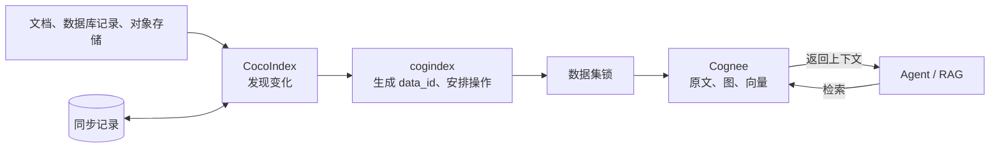

# cogindex

[](https://github.com/liuqjjin/cogindex/actions/workflows/ci.yml)
[](pyproject.toml)
[](LICENSE)

[英文版](README.en.md)

第一次把文档导入 Cognee 很简单，调用 `add()` 和 `cognify()` 就可以。麻烦通常出在
第二次同步：正文修改后，旧的图和向量不会自动删除；源文件消失后，需要找到原来的
`data_id` 才能清理；删除如果中途退出，还可能留下标记为“处理完成”的原文记录，却没有
对应的图数据。

实现上，cogindex 是 CocoIndex 的一个自定义目标（target）。CocoIndex 发现源数据的
变化，cogindex 用稳定的文档标识生成固定 `data_id`，再按顺序完成新增、替换和删除。
知识抽取和检索仍交给 Cognee；cogindex 只管文档变化后的同步。

## 工作方式



Agent 或 RAG 应用仍然直接查询 Cognee。cogindex 不改变检索排序、提示词和答案生成。
更完整的数据流和失败处理见[设计说明](docs/design.md)。

## 运行示例

下面的示例不需要模型密钥：

```bash
git clone https://github.com/liuqjjin/cogindex.git
cd cogindex
uv sync --all-extras
uv run python examples/agent_memory_demo.py
```

脚本先写入 `ProjectAtlas routes alerts to BlueQueue`，同步后从 Cognee 图中查询当前路由；
随后把同一份 `routing.md` 改成 `GreenQueue`，再次同步并查询。关键输出如下：

```text
Agent answer: ProjectAtlas routes alerts to BlueQueue.
Agent answer: ProjectAtlas routes alerts to GreenQueue.
Graph check: GreenQueue present=True
Graph check: BlueQueue absent=True
```

示例里的 `MemoryAgent` 只有一个图查询方法。LLM 和嵌入模型使用固定输出，Cognee 的本地
数据库、图存储和向量存储仍按真实流程运行。

目录同步见 [`examples/quickstart_live.py`](examples/quickstart_live.py)，真实模型配置见
[`.env.example`](.env.example)。

## 接入 CocoIndex

项目尚未发布到 PyPI，可以直接从 Git 安装：

```bash
python3 -m pip install "git+https://github.com/liuqjjin/cogindex.git"
# 或
uv add "cogindex @ git+https://github.com/liuqjjin/cogindex.git"
```

最小接入代码如下。完整的目录同步示例见
[`examples/quickstart_live.py`](examples/quickstart_live.py)。

```python
from pathlib import Path

import cocoindex as coco
import cogindex

COGNEE = coco.ContextKey[cogindex.CogneeRuntime]("cognee")

runtime = cogindex.LocalCogneeRuntime(
    data_root=Path("./data/cognee"),
    system_root=Path("./data/cognee-system"),
)
environment = coco.Environment(coco.Settings.from_env(db_path="./data/cocoindex-tracking"))
environment.context_provider.provide(COGNEE, runtime)


@coco.fn
async def app_main() -> None:
    target = await coco.use_mount(cogindex.declare_dataset_target, COGNEE, "docs")
    target.declare_document("guide.md", "CocoIndex tracks changes.", label="guide.md")
```

`"guide.md"` 是这篇文档在源系统中的稳定标识，也可以换成仓库相对路径、数据库主键或
对象存储键。正文可以修改，这个标识不要跟着变。

`ContextKey` 同样要使用固定的逻辑名称，例如 `"cognee"`。它会写入 CocoIndex 的同步记录，
也参与文档 ID 的生成；不要在其中放 URL、DSN 或密钥。

## 同步规则

| 文档变化 | 处理方式 |
| --- | --- |
| 新增 | 写入原文，执行 `cognify` |
| 正文、外部元数据、`node_set` 或处理配置变化 | 清理旧图和向量，沿用原 `data_id` 重新写入和处理 |
| `importance_weight` 变化 | 删除原文记录，沿用原 `data_id` 重新创建 |
| 仅标签变化，且上一次同步状态已确认 | 更新标签，不重复抽取 |
| 删除 | 删除原文，以及不再被其他文档引用的图和向量数据 |

CocoIndex 的同步记录和 Cognee 存储不在同一个事务中。如果 Cognee 写入完成后进程退出，
下次同步会按尚未确认的新旧记录重新执行替换或删除。只有 Cognee 写入成功后，新的同步
记录才会提交。

同一数据集的写入、删除和整库清理使用同一把锁。默认锁适合单进程、单事件循环；多个
进程或事件循环写同一数据集时，可以安装 `postgres` 可选依赖并使用
`PostgresAdvisoryLockProvider`。所有写入方必须连接同一个 PostgreSQL 数据库作为锁服务。

`cogindex.doctor()` 检查本地存储和模型配置。`verify_dataset()` 检查文档缺失、多余、
处理未完成和标签不一致，但不会逐项比较图节点和向量内容。

## 兼容性与限制

当前版本为 `0.1.0`，支持 Python `>=3.11,<3.14`、CocoIndex `>=1.0.18,<2` 和
Cognee `>=1.4.0,<1.5`。API 仍可能调整，建议先用于可以重新构建的数据集。

- Cognee REST `add` 不能接收自定义 `data_id`，目前只支持 Python SDK。如果进程已经进入
  `cognee.serve()` 的远程模式，需要先执行 `await cognee.disconnect()`；
- `LocalCogneeRuntime` 必须显式设置 `data_root` 和 `system_root`。同一进程中的运行时
  实例要使用同一组目录，并且只接受 `tenant="default"`；
- 卸载由系统管理的目标会删除整个 Cognee 数据集。`managed_by="user"` 只跳过这次整库
  清理；目标仍在时，不再声明的文档照常删除；
- Cognee 整库清理不会向上抛出个别原文删除失败，极端情况下可能留下无法从返回值发现的
  孤立原文记录；
- CocoIndex 同步记录丢失后，普通重跑无法判断哪些 Cognee 文档已经从源端删除。独占
  数据集需要停止写入、清空后全量同步；共享数据集需要人工核对或改用新的数据集名称；
- `verify_dataset()` 看不到图和向量是否仍与当前正文一致。

## 开发

```bash
make ci                # Ruff、mypy、上游源码审阅记录校验、单元测试、属性测试
make test-integration  # 真实本地 Cognee，模型调用使用固定输出
make test-postgres     # PostgreSQL advisory lock
make coverage
make smoke             # 构建 wheel，并在干净环境中导入
make benchmark-smoke   # 检查基准脚本
```

核心检查在 Linux、macOS 和 Python 3.11–3.13 上运行。另有本地 Cognee、PostgreSQL、
依赖审计和 wheel 安装任务。

基准脚本比较“清空后全量重建”和“只同步变化的文档”。当前的小语料结果表明，增量方案
重新处理的文档更少，但运行时间并没有更短。测试方法、原始结果和复现命令见
[基准测试](docs/benchmarks.md)。

## 代码和文档

- [公开 API](src/cogindex/__init__.py)
- [设计说明](docs/design.md)
- [设计记录](docs/adr/)
- [上游行为记录](docs/upstream-audit/)
- [贡献指南](CONTRIBUTING.md)

cogindex 依赖 [CocoIndex](https://github.com/cocoindex-io/cocoindex) 和
[Cognee](https://github.com/topoteretes/cognee)，与两个项目均无隶属关系。

项目使用 Apache-2.0 许可证，第三方依赖和许可证说明见
[ATTRIBUTION.md](ATTRIBUTION.md)。
