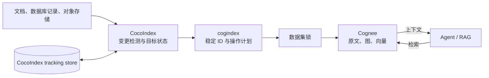
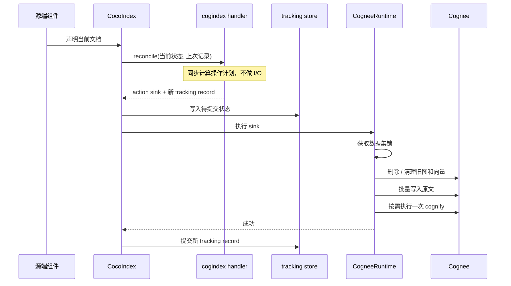

# 设计说明

这份文档说明 cogindex 怎样把一组持续变化的文档同步到 Cognee。具体取舍和上游依据
仍以 [`docs/adr/`](adr/) 为准。

## 范围

cogindex 处理的是文档型知识库：

- 源端不断出现新增、修改和删除；
- Cognee 保存原文，并从原文生成图节点、关系和向量；
- Agent 或 RAG 应用直接从 Cognee 检索；
- 同一个源文档修改后，旧的图和向量不能继续参与检索。

cogindex 不负责对话历史、检索排序、提示词和答案生成，也不改动 Cognee 的知识抽取
逻辑。它只负责把 CocoIndex 发现的变化转换成正确的 Cognee 写入、替换和删除操作。

## 组件

| 组件 | 职责 |
| --- | --- |
| 源端组件 | 声明当前应该存在的文档及处理配置 |
| CocoIndex | 发现声明变化，保存上次同步记录，调用 target handler |
| cogindex | 生成稳定 `data_id`，判断新增、替换、重建、标签更新或删除 |
| `CogneeRuntime` | 执行 Cognee 的写入、清理、处理和读取 |
| Cognee | 保存原文、图和向量，供上层应用查询 |

target 分为两层。数据集 handler 管理配置和数据集生命周期；文档 handler 管理数据集下的
每一份文档。卸载系统管理的数据集 target 时，数据集 handler 会执行整库清理。

## 一次同步怎样执行

`reconcile()` 是同步函数，只比较声明和跟踪记录。连接、读写数据库、获取锁等外部操作
都在异步 sink 中完成。这样做是 CocoIndex target 扩展点的要求，也避免在引擎持有状态表
互斥锁时执行网络或磁盘 I/O。

一批文档进入 sink 后，操作顺序固定：

1. 需要重建的文档先硬删除；
2. 普通替换清理原有图和向量，但保留原文记录；
3. 批量执行一次 `add`；
4. 只有存在需要重新处理的文档时才执行一次 `cognify`。

标签更新和纯删除批次不需要 `cognify`。Cognee 的 `add` 调用会关闭
`incremental_loading` 和 `data_cache`；否则完成状态可能让改过的原文直接跳过摄入。

## 文档身份

每份文档的 `data_id` 是 UUID5，输入包括：

- 固定的 cogindex namespace 和身份版本；
- runtime 的 `ContextKey` 名称；
- tenant；
- 数据集名称；
- 调用方提供的文档稳定标识。

各字段使用带长度前缀的编码后再计算 UUID，避免简单字符串拼接产生歧义。正文不参与
身份计算，因此修改正文仍然指向同一条 Cognee 原文记录。正文、元数据和处理配置分别
计算指纹，只用于判断需要执行哪一种操作。

文档稳定标识可以是仓库相对路径、数据库主键或对象存储 key。改名会得到新的身份，
因此按删除旧文档、创建新文档处理；本项目不做重命名检测。

## 变化对应的操作

| 变化 | 操作 | 原因 |
| --- | --- | --- |
| 新文档 | `add` 后 `cognify` | 创建原文及图、向量 |
| 正文变化 | 清理旧图和向量，沿用原 ID 重新写入和处理 | Cognee 重新 `add` 不会自动删除旧结果 |
| 外部元数据或 `node_set` 变化 | 与正文变化相同 | 这些字段会影响知识抽取结果 |
| 模型、提示词、分块或向量配置变化 | 与正文变化相同 | Cognee 的完成状态不包含这些配置 |
| `importance_weight` 变化 | 硬删除后沿用原 ID 重建 | Cognee 不会更新已有原文的该字段 |
| 仅标签变化且上次状态已确认 | 重新写入标签，不重复抽取 | 标签不影响图和向量 |
| 文档不再声明 | 硬删除 | 清理原文及不再被其他文档引用的数据 |

处理配置的指纹包含图模型及其 schema、抽取提示词、分块器和块大小、LLM、嵌入模型及
向量维度。连接地址、密钥、锁配置和日志级别不会进入指纹，也不会因为运维配置变化而
重建知识图谱。

## 失败和重试

CocoIndex 的跟踪库与 Cognee 的存储不能放进同一个事务。cogindex 使用至少一次执行：
sink 成功后才允许 CocoIndex 提交新的跟踪记录；如果进程在外部写入后、记录提交前退出，
下次同步会把新旧记录都视为可能状态，并重新执行幂等操作。

当上一次状态不确定时，正文未变化也至少执行一次替换。原因是 Cognee 的硬删除顺序为
先删除图和向量、最后删除带完成状态的原文记录。若中途退出，原文可能仍显示处理完成，
实际图和向量却已经不存在。直接按新增路径重试会被完成状态跳过，留下永久缺失。

收敛条件是：

1. 源文档和处理配置停止变化；
2. CocoIndex 跟踪库没有丢失；
3. 不存在绕过 cogindex 的并发写入；
4. 后续至少有一次同步成功完成。

满足这些条件后，多次重试会得到相同的当前文档集合。`verify_dataset()` 可检查原文是否
存在、身份、处理完成状态和标签，但目前看不到图或向量是否仍对应当前正文。

## 并发

同一数据集的文档批次和整库清理共用一把锁。默认的 `InProcessLockProvider` 适合
单进程、单事件循环；指向同一组本地 Cognee 存储目录的多个 `LocalCogneeRuntime`
也必须共用这组进程内锁。

多进程或多事件循环部署使用 `PostgresAdvisoryLockProvider`。所有写入方需要连接同一个
PostgreSQL 数据库作为锁服务。锁只约束通过 cogindex 发起的操作，不能阻止其他进程直接
调用 `cognee.add()`、`cognee.cognify()` 或删除接口。

## Agent 和 RAG 场景

这类同步对长时间运行的 Agent 有三个直接用途：

- 产品规则或内部制度修改后，下一次检索只看到当前版本；
- 运维手册、服务目录发生变化后，Agent 不会继续引用已经删除的路径或服务；
- 数据源移除文档后，对应原文以及失去最后引用的图和向量数据一起清理。

[`examples/agent_memory_demo.py`](../examples/agent_memory_demo.py) 用一个图查询工具演示
第一种情况：`ProjectAtlas` 的路由从 `BlueQueue` 改成 `GreenQueue`，再次提问得到新队列，
并直接检查旧实体已从图中消失。示例没有引入 Agent 框架，目的是把同步正确性与回答生成
分开验证。

## 已知限制

- Cognee REST `add` 不能接收调用方提供的 `data_id`，所以当前只支持本地 Python SDK。
- `cognee.serve()` 会把顶层操作切到 REST；本地 runtime 会拒绝这种状态，调用方需要先
  执行 `await cognee.disconnect()`。
- `LocalCogneeRuntime` 只支持 `tenant="default"`，实际访问范围由 Cognee user 决定。
- 系统管理的 target 卸载时会删除整个数据集；`managed_by="user"` 只跳过这次整库清理。
- Cognee 在整库清理中不会向上抛出个别原文删除失败，极端情况下可能留下无法由 SDK 结果
  检出的孤立原文记录。
- CocoIndex 跟踪库丢失后，cogindex 无法知道哪些 Cognee 原文原本由它管理、但已经从源端
  删除。独占数据集需要停止写入、清空后全量同步；共享数据集需要人工核对或改用新名称。
- `verify_dataset()` 不逐项比较正文、图节点和向量，不能单独证明检索内容没有过期。

## ADR 索引

- [ADR-0001](adr/0001-cocoindex-target-not-memoized-function.md)：为什么使用 target，而不是
  memoized function
- [ADR-0002](adr/0002-stable-document-identity.md)：稳定文档身份
- [ADR-0003](adr/0003-consistency-model.md)：至少一次执行和收敛条件
- [ADR-0004](adr/0004-replace-delete-protocol.md)：替换与删除顺序
- [ADR-0005](adr/0005-configuration-invalidation.md)：处理配置变化
- [ADR-0006](adr/0006-concurrency-and-locking.md)：数据集锁
- [ADR-0007](adr/0007-runtime-abstraction.md)：运行时边界
